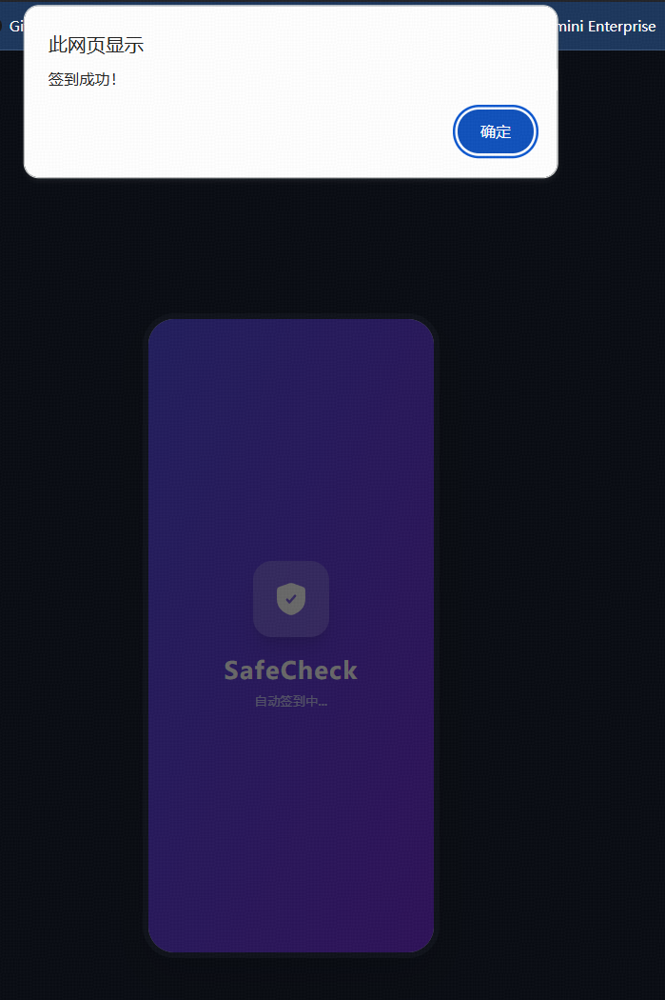
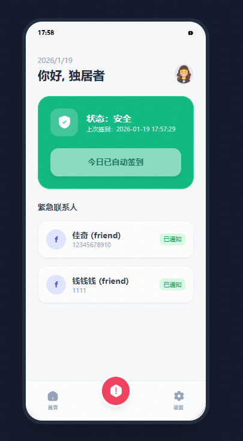
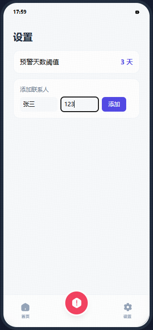
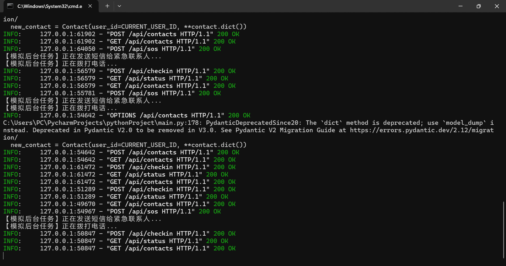

# 仿死了么App

### 本次想法从产生到运行出最终效果总耗时2.5h，全程使用AI工具生成，本人未写任何代码，包括从产品PRD->UI原型图->前后端代码实现。感叹AI现在的强大啊！

最近苹果商店一爆款App“死了么”冲上热搜，该App是为独居人群打造的轻量化安全工具，通过签到监测与紧急联络机制，构建无感化安全防护，让独处生活更安心，异常未签到自动通知，提前设置一位紧急联系人（家人或好友），若连续多天未签到则会触发报警并联系紧急联系人。

- **后端 (Backend)**: Python **FastAPI** (轻量、高性能，适合处理异步任务和API)。
- **数据库 (Database)**: **SQLite** (MVP阶段最便捷，无需配置，支持本地存储)。
- **前端 (Frontend)**: 原生 **HTML5 + TailwindCSS + Vue.js (CDN版)**。
  - *决策理由*：你提供的原型是单页HTML，直接引入Vue.js (轻量级CDN) 可以让你在不搭建复杂编译环境（如Webpack/Vite）的情况下，直接利用双向绑定和组件化能力，无缝对接后端API。

------

### 一、 后端代码 (Python FastAPI)

此后端实现了核心的“状态机逻辑”、签到记录和紧急联系人管理。

请确保安装依赖：`pip install fastapi uvicorn sqlalchemy pydantic`

**文件：`main.py`**

------

### 二、 前端代码 (HTML + Vue 3 改造版)

1. 引入了 Vue 3 CDN。
2. 将静态数据替换为从 `http://localhost:8000` 获取的动态数据。
3. 实现了真实的倒计时和状态切换逻辑。

------

### 三、 运行指南

1. **运行后端**：
   - 在终端运行：`uvicorn main:app --reload`
   - 看到 `Application startup complete.` 表示后端已启动，监听 `localhost:8000`。
2. **运行前端**：
   - 将前端代码保存为 `index.html`。
   - 直接在浏览器打开该文件，或者使用 Live Server 打开。
   - 你会看到启动页 -> 自动调用 `/checkin` -> 进入首页 -> 状态变为绿色。

### 四、 核心功能

功能点PRD要求实现方案**无感签到**每日首次打开自动触发前端 `onMounted` 钩子中调用 `doCheckin()`，模拟App冷启动逻辑。**状态机**2天/3天/5天不同预警后端 `calculate_status` 函数根据 `last_checkin` 时间差动态计算状态。**SOS防误触**长按/倒计时取消前端 SOS 页面包含5秒倒计时逻辑，点击取消可中断请求。**数据隐私**本地+云端当前使用本地 SQLite 数据库，所有数据均存储在 `safecheck.db` 文件中。

## 五、运行效果图

